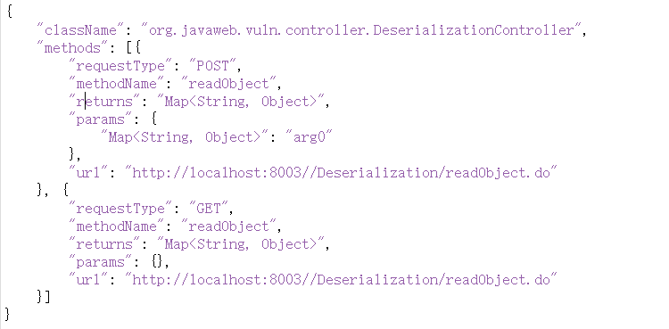

# 项目报告

## demo开发历程

   3.6号晚7点，正在食堂吃晚饭，接受到老师发来的任务。仔细阅读了任务内容，提到了java agent技术，这是我之前没用到过的东西。
   赶紧百度了一下，查到了 https://www.cnblogs.com/chengxuzhixin/p/14552275.html 这一篇文章 提到了使用java agent如何修改字节码。还提到了aop。
   因为自己有过aop（面向切面编程的经验），实现过aop防抖（防止用户多次点击）。主要核心是在方法前后进行增强，建立切面。所以比较好理解java agent的作用。
   又去b站，查到了 https://www.bilibili.com/video/BV17n4y1f78o/?spm_id_from=333.337.search-card.all.click&vd_source=35718cb91f9d7264dbf6afd27e70852f 这个视频，讲解了java agent怎么去实现，有什么作用，例如日志，性能分析，修改字节码文件。
   这时基本有了大致的方向，在看到需要提取类的api信息，看到类信息，就想到了反射，这是动态获取类信息的方法。反射还算比较熟悉，有过相关经验。
    --------------------------------------------------------------------------------------------------------------------------
   吃完饭后回到工位，打开 https://github.com/javaweb-rasp/javaweb-vuln 项目地址。熟悉一个项目，就要把他在本地启动起来。
    拉取项目到本地idea中，看到了spring boot2，spring boot3这两个模块，应该是启动的入口。因为我一般用boot3来做项目，所以就打开spring boot3中的配置文件，看到了数据库的配置，又看到了sql文件，所以就打开了Navicat Premium 17 去建立了javaweb-bbs数据库，在该库
    下运行了sql文件。之后点击spring boot 3Application进行启动项目。期间也看看了pom.xml文件，知道vuln-springboot3模块 依赖 vuln-core模块。结果能在本地启动，算是成功了一半。
    ---------------------------------------------------------------------------------------------------------------------------
    接下来就开始建立vuln-agent模块，因为需要把它打包成jar包。一开始我是agent写在了vuln-core模块里，所以这一步是不太好的，不利于开闭原则。
    之后知道vuln-agent模块下的Agent需要实现premain方法，该方法有两个参数，其中一个是Instrumentation inst，inst有个inst.addTransformer方法，可以使用lambda表达式 new 一个 ClassFileTransformer()，类似监听器的作用。这一步让我想到了EasyExcel，
    EasyExcel 也可以定义监听器，监听读入的每一行数据，并进行处理。而agent是当每一个类加载前，进行处理。处理的函数是：
    public byte[] transform(ClassLoader loader, String className, Class<?> classBeingRedefined, ProtectionDomain protectionDomain, byte[] classfileBuffer) 
    这时我不太了解这个transform的参数是什么，就问了问chatgpt，知道了loader和className。这时候就明白了可以根据两个参数获取类的信息，
    所以就用到了 Class<?> clazz = Class.forName(className.replace('/', '.'), false, loader);这个函数，他主要是根据类名，和类加载器获取类文件。就是clazz
    得到了clazz，一切就好办了，clazz.getAnnotation(RequestMapping.class)可以获取注解信息，根据注解  String[] classUrls = classRequestMapping.value();又可以获取类注解的url。
    又可以获取类中的方法 Method[] methods = clazz.getDeclaredMethods(); 得到方法后，遍历方法集合，通过method.getAnnotation（）获取方法的注解， String[] urls = requestMapping.value()获取方法注解的url，method.getName()获取方法的名称
    在获取类的返回类型中遇到了一些问题：method.getReturnType().getSimpleName(); 返回的类型不太对，例如Map<Strint,Object> 就返回了Map。这一步不太好处理，我就问了问chatgpt怎么返回正常结果，gpt给了我这个getMethodReturnType()函数，我加到了代码里，
    调整了调整，结果可以正确返回了。这时候api的所有信息都能知道了，因为要输出json格式，我经常使用的就是创建Map<String,Object> 放入json数据，在使用JSONobject.toJSONString()方法返回json字符串，最后使用BufferedWriter将数据写到本地。
    以上就是我的开发流程。

## 1.本地启动项目

拉取 https://github.com/javaweb-rasp/javaweb-vuln 至本地idea 并查看项目结构。
建立本地数据库javaweb-bbs，修改vuln-springboot3 application.properties配置数据库，启动springboot3Application能够正常运行。

## 2.新建vuln-agent模块

建立Agent类实现premain方法，在类加载前对类进行加强。
permain方法如下：注册了一个ClassFileTransformer，每当类进行加载时都会进行加强。可动态替换getApi方法的第二个参数扫描不同包下的api信息。

public static void premain(String agentArgs, Instrumentation inst) {

        System.out.println("-------------------------------------------------agent启动-----------------------------------------------------------");

        inst.addTransformer(new ClassFileTransformer() {
            @Override
            public byte[] transform(ClassLoader loader, String className, Class<?> classBeingRedefined,
                                    ProtectionDomain protectionDomain, byte[] classfileBuffer) {
                //替换packageName，可检测不同包下的api  getApi是主方法
                getApi(className,loader,"org/javaweb/vuln/controller/");
                // 返回null表示不修改类文件
                return null;
            }
        });
    }
getApi是主方法，主要采取反射的机制，获取类的类名，类的url，类的方法，方法名，方法入参，方法注解，方法url，方法返回类型。
主要代码为：

### 反射获取类的信息

Class<?> clazz = Class.forName(className.replace('/', '.'), false, loader);   

### 获取类名

classInfo.put("className", clazz.getName());  

### 获取类上的注解

RequestMapping classRequestMapping = clazz.getAnnotation(RequestMapping.class);

### 获取类的方法

Method[] methods = clazz.getDeclaredMethods();

### 获取类方法的注解

RequestMapping requestMapping = method.getAnnotation(RequestMapping.class);

### 获取类上的url

partApi = Arrays.toString(classUrls).replace("[","").replace("]","");

### 获取方法上的url

String[] urls = requestMapping.value();
String mainApi = Arrays.toString(urls).replace("[","").replace("]","");

### 获取方法的入参

Parameter[] parameters = method.getParameters();
for (Parameter parameter : parameters) {
params.put(getParamsType(parameter), parameter.getName());
}   

### 获取方法的返回值
getMethodReturnType用于返回处理后的type格式
String methodReturnType = getMethodReturnType(method);
methodInfo.put("returns",methodReturnType);

在resources下建立META-INF\MANIFEST.MF并进行配置

修改pom.xml文件，暴露META-INF\MANIFEST.MF文件。

## 3.将vuln-agent模块进行打成jar包

在springboot3Application中的run configuration添加 -javaagent:"D:\git repository\javaweb-vuln-agent\vuln-agent\target\vuln-agent-3.0.3.jar" 该路径是jar包的绝对路径。

## 4.重新运行springboot3Application

即可在D：\\apis下看到所有类的api的json格式，输出位一个.txt文件。

提取json结构如下：（可修改格式）
